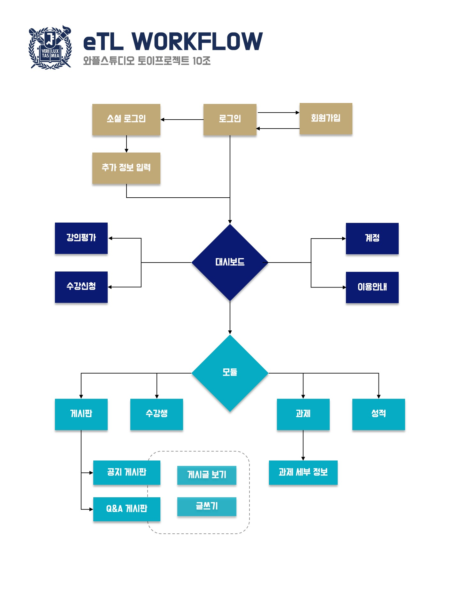
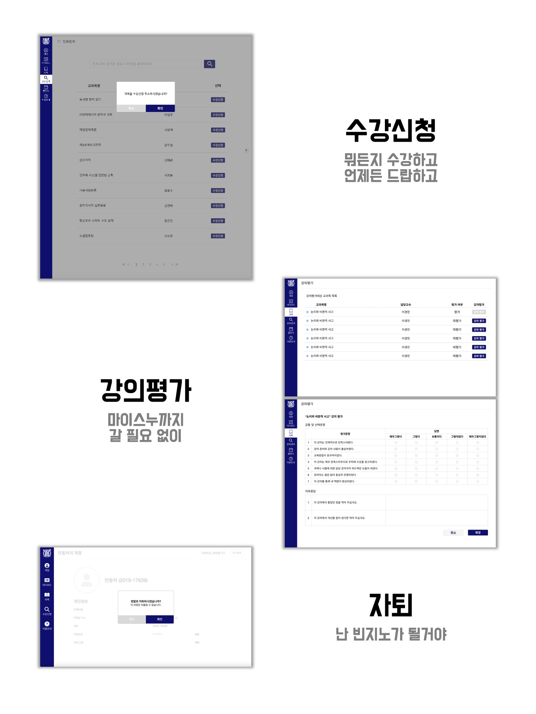
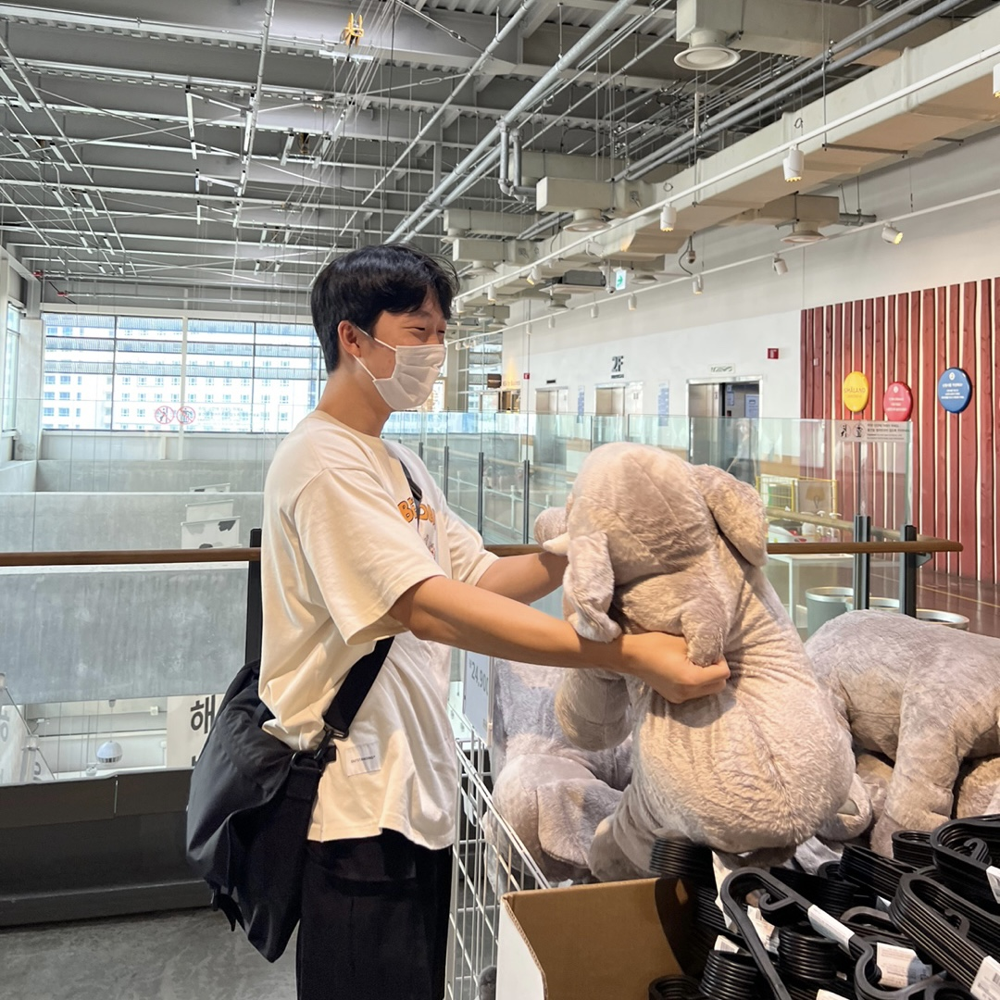
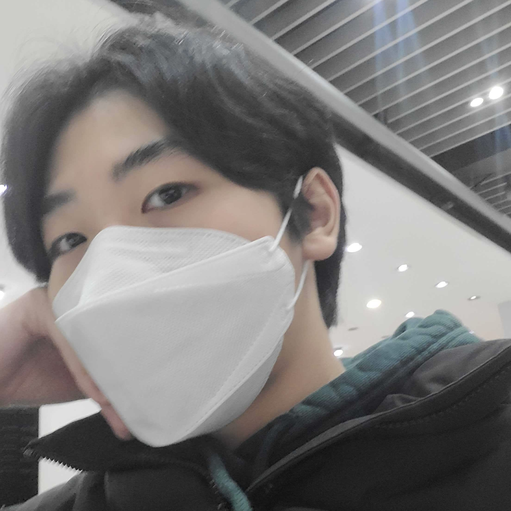
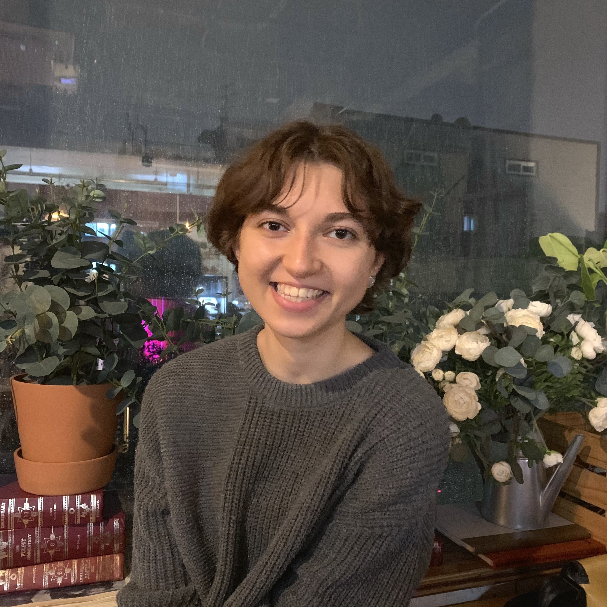

# 와플스튜디오 토이프로젝트 10조

팀명: eTL 너무십조 ㅋㅋ

## ⭐️ About the Project

애증의 웹사이트, 서울대학교 eTL 입니다.

### ❗️ 체험 시 `유의 사항`
* 최적의 체험을 위해서는 **구글 크롬**을 이용해 주세요!
* 너무 **고화질의 사진, 고용량의 파일**은 업로드 하지 말아주세요! 백엔드가 아파합니다.
* `신규 계정`을 생성하면 수업, 과제, 성적이 하나도 없어서 체험의 재미가 반감됩니다. 회원가입은 맛만 보시고 미리 만들어진 계정으로 로그인해 주세요!
> `ID:` wafflekim@snu.ac.kr  
> `PASSWORD:` wafflekim
* `자퇴` 시 계정이 서버 상에서 **즉시** 삭제됩니다. 주의해 주세요! (시연용 계정을 자퇴시키지 말아주세요)

#### 🔸   주소

> https://dvn7ib10xdyoj.cloudfront.net

#### 🔸   연결이 되지 않을 경우

> 1. Git Clone으로 프로젝트 파일을 받아옵니다.  
> `git clone "https://github.com/wafflestudio20-5/team10-web.git"`
> 2. toyproject 디렉토리로 이동합니다.  
> `cd team10-web/toyproject`
> 3. npm이나 yarn을 이용해 실행해 줍니다.  
> `npm run start` or `yarn start`

### 🌊 Workflow

### 🔧 기술 스택

|                                               프론트엔드                                               |                          백엔드                          |디자인|
|:-------------------------------------------------------------------------------------------------:|:-----------------------------------------------------:|:---:|
|    TypeScript React SCSS Modules Axios  ESLint & Prettier S3 + Cloudfront     | Django MySQL Simple JWT Elastic Beanstalk | Figma Adobe Illustrator |

### 🔹 원본 사이트와의 비교

## ⭐️ 함께한 사람들

### 🧇 Front End

|                              |                 |                      |
|:--------------------------------------------------------------------------------------------|:---------------------------------------------------------------------------------|:-----------------------------------------------------------------------------------|
| **`이름`** &nbsp;안광휘 **`주요 업적`**&nbsp;소셜 로그인 및 세션 관리 **`한줄 소감`**&nbsp;"공동저자 CHAT GPT" | **`이름`**&nbsp;김채현 **`주요 업적`**&nbsp;게시판 CRUD 기능 **`한줄 소감`**&nbsp;"개발이 재미있어요" | **`이름`**&nbsp;안동하 **`주요 업적`** &nbsp;배포와 잡일  **`한줄 소감`** &nbsp;"이티엘 안십조..." |

### 🧇 Back End

|  |          |  |
|:---------------------------------------------------------------|:-------------------------------------------------------------------------|:-----------------------------------------------------------|
| **`이름`** 김영인 **`주요 업적`** JWT, 소셜로그인, 게시판 구현    **`한줄 소감`** "세상에 혼자 할 수 있는 일은 없다."| **`이름`** 이현진 **`주요 업적`** ETL 과제, 파일 관리  **`한줄 소감`** "개발은 끝이 없네요" | **`이름`** 임수 **`주요 업적`**  AWS 연결 및 잡다한 일 담당 **`한줄 소감`**  "실력의 부족함을 많이 느꼈습니다."  |

### 🧇 Designer

|               |
|:---------------------------------------------------------------------------|
| **`이름`** Amina **`주요 업적`** 디자인  **`한줄 소감`** "지난달 스크린타임 50% 증가했습니다" |

